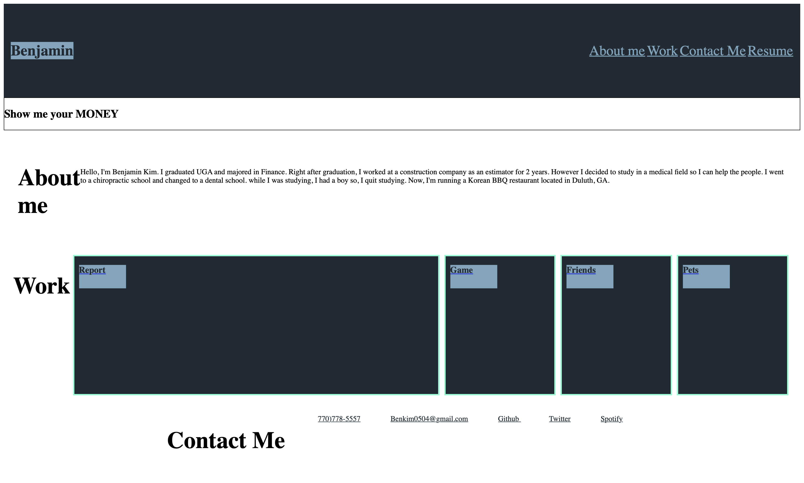

# HOMEWORK-2 (CSS Portfolio)
>We were asked to build a portfolio page from scratch. 

## To Do List:
* Navigate the page accordingly by clicking the links.
* Using Pseudo-Element&Class, 
* Through the media quary, changed the color based on the size of the screen

### This is Mock-up page.

Benjamin Kim
